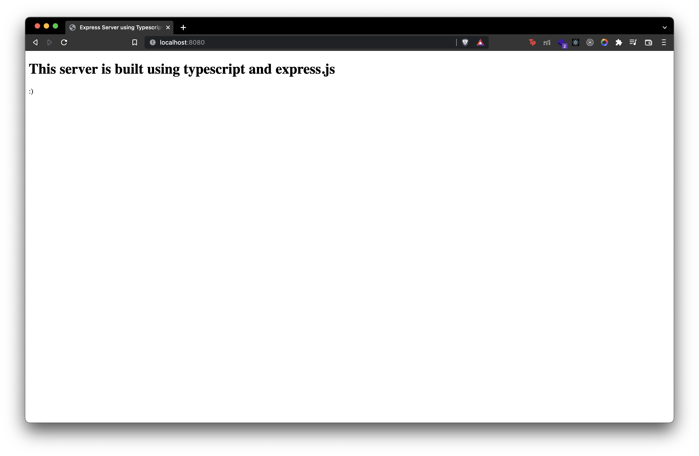

# Express-Mongoose-Typescript Server Starter Template

**NOTE: You need to have a local setup of mongodb to use this template.**

## Steps to use ([Demo Video](https://google.com)):

1. `git clone https://github.com/shabh2412/Express-Mongoose-Typescript-Starter-Template.git`
2. `cd Express-Mongoose-Typescript-Starter-Template`
3. `npm i`
4. `npm run dev`
5. Go to `http://localhost:8080/` - you should be able to see the sample index page as shown below.

